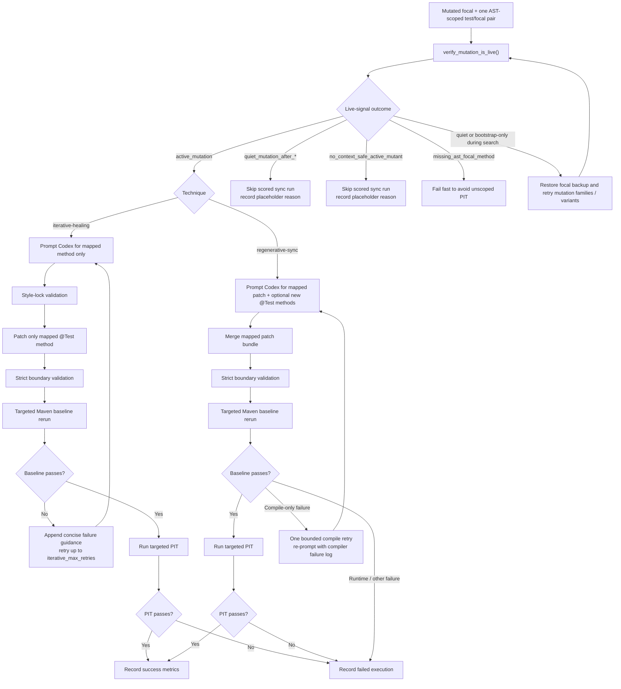

# AgoneTest / Phase II White-Box Pipeline

## Scope

This diagram captures the concrete pipeline implemented by the current codebase, not just the paper-level overview. It covers:

- dataset and repository preparation,
- worker-scoped execution,
- AST-based filtering and method scoping,
- deterministic focal mutation,
- the mutation-live gate,
- the two synchronization strategies (`iterative-healing` and `regenerative-sync`),
- build / JaCoCo / PIT execution,
- per-project outputs, multi-worker merges, and Phase II reaggregation.

## End-to-End White-Box Diagram

```mermaid
flowchart TB
  subgraph Inputs["1. Inputs and Configuration"]
    I1["Classes2Test JSON records<br/>focal/test ids, file paths, optional focal/test method ids"]
    I2["repos/&lt;project&gt;<br/>cloned source repositories"]
    I3["run_settings.yaml<br/>agents, prompt templates, retries, Codex timeouts"]
    I4[".env / environment variables<br/>JAVA paths, Maven paths, worker id, smoke flags"]
  end

  subgraph Prep["2. Preparation and Worker Isolation"]
    P1["extract.py (offline prep)<br/>clone repos, parse dataset, build classes.csv and project_info.json"]
    P2["path_context.py<br/>compiledrepos/worker_&lt;id&gt;/...<br/>output/worker_&lt;id&gt;/..."]
    P3["run_smoke_test.py (N=1 lane)<br/>materialize one repo slice + smoke_target.json"]
  end

  subgraph Orchestrator["3. Orchestrator: agone_test.py"]
    O1["ExecutionManager.initialize()<br/>load agents + prompts from YAML"]
    O2["select_projects_to_process()<br/>intersect classes.csv, project_info.json, compiled workspace"]
    O3["Per project/module<br/>load or compute project_structure.json and project_dependencies.json"]
    O4["_filter_rows_by_ast_verified_mapping()<br/>drop rows whose declared test->focal pair is not AST-confirmed"]
    O5["_split_human_baseline()<br/>run human baseline first, then follow-up generators"]
  end

  subgraph BaselineMutation["4. Baseline and Controlled Source Evolution"]
    B1["edit_pom_file() / Gradle equivalent<br/>inject JaCoCo + PIT + targeted Surefire configuration"]
    B2["Human baseline on unmutated code<br/>run existing tests and collect baseline coverage / smells"]
    B3["apply_focal_mutations()<br/>backup focal source and apply deterministic mutation<br/>family rotation: logical -> signature -> exception"]
  end

  subgraph SampleScope["5. Per-Sample Scoping"]
    S1["For each row<br/>resolve worker-local test_path + focal_path"]
    S2["_extract_ast_method_pair()<br/>derive AST_Test_Method + AST_Focal_Method<br/>prefer Test_Case / Focal_Method when available"]
    S3["Build scoped dataframe row<br/>used to keep Maven / PIT execution narrowly targeted"]
    S4["Gather prompt context<br/>package name, JUnit/TestNG info, Mockito allowance,<br/>project structure, dependencies, focal source, test source"]
  end

  subgraph LiveGate["6. Mutation-Live Gate for Phase II Sync"]
    G1["run_maven_baseline_stage()<br/>targeted jacoco:prepare-agent test jacoco:report"]
    G2{"Mutated focal already causes<br/>a mapped test failure?"}
    G3["If quiet or bootstrap/context-unsafe<br/>restore focal from backup"]
    G4["Apply prioritized retry mutation<br/>preserve AST focal target scope<br/>search mutation families / variants until live or exhausted"]
    G5["Emit live-signal classification<br/>active_mutation / quiet_mutation_after_* /<br/>no_context_safe_active_mutant / missing_ast_focal_method"]
    G6{"Active mutation available<br/>for a scored sync run?"}
    G7{"Chosen synchronization technique"}
  end

  subgraph Iterative["7A. Iterative Healing"]
    H1["utils.generate_test_with_codex(..., output_contract='mapped_method')"]
    H2["Prompt contains<br/>updated focal class, existing test class,<br/>mapped test method anchor, AST mapping,<br/>mapped focal method source, failure log"]
    H3["Codex returns only the mapped @Test method block"]
    H4["Validate iterative style lock<br/>preserve declaration, style anchor, no helper/import/annotation drift"]
    H5["inject_mapped_test_method_patch()<br/>replace only the mapped @Test block"]
    H6["Strict boundary validation<br/>reject any change to unmapped tests"]
    H7["Re-run targeted baseline<br/>then targeted PIT<br/>retry up to iterative_max_retries"]
  end

  subgraph Regen["7B. Regenerative Sync"]
    R1["utils.generate_test_with_codex(..., output_contract='mapped_method_additive')"]
    R2["Prompt contains<br/>updated focal class, AST target mapping,<br/>mapped focal context, and compiler failure log on retry"]
    R3["Codex returns mapped @Test block<br/>plus optional brand-new @Test blocks"]
    R4["inject_regenerative_test_method_patch_bundle()<br/>replace mapped test and append only new @Test methods"]
    R5["Strict boundary validation<br/>preserve package/class/imports/helpers<br/>keep unmapped tests unchanged"]
    R6["Re-run targeted baseline<br/>then targeted PIT"]
    R7["Optional compile-only retry<br/>re-prompt with compiler failure log<br/>bounded by regenerative_compile_retry_max"]
  end

  subgraph Other["7C. Other Generator Lanes"]
    A1["human / evosuite / other full-class generation"]
    A2["Generate or restore full test classes"]
    A3["Optional errorCorrection.correct_errors()<br/>Codex file-in-place repair loop for compile/runtime failures"]
  end

  subgraph Metrics["8. Measurement and Project Outputs"]
    M1["record_tracking_metrics()<br/>Chance, tokens, iterations_to_pass,<br/>high_signal, signal_reason"]
    M2["configure_test_smell_detector()<br/>run_test_smell_detector()"]
    M3["snapshot_coverage_reports()<br/>retrieve_code_coverage_and_cyclomatic_complexity()"]
    M4["generate_output_csv_test_type()<br/>per test_type / technique CSV"]
    M5["generate_output_csv_project()<br/>&lt;project&gt;_Output.csv"]
    M6["generate_output_agone_files()<br/>output_agone_classes.csv<br/>output_agone_projects.csv<br/>output_agone_mean.csv<br/>output_agone_mean_filtered.csv<br/>output_agone_info.txt"]
  end

  subgraph Aggregation["9. Multi-Worker and Phase II Aggregation"]
    W1["merge_worker_outputs.py<br/>merge worker_* classes.csv, project_info.json,<br/>*_Output.csv, focal_mutations.json, backups"]
    W2["reaggregate_phase2_metrics.py<br/>pair human vs iterative vs regenerative rows,<br/>build RQ2/RQ3 CSV + JSON summaries"]
  end

  I1 --> P1
  I2 --> P1
  I3 --> O1
  I4 --> O1
  I4 --> P2
  I1 --> P3
  I2 --> P3

  P1 --> P2
  P1 --> O2
  P3 --> P2
  P3 --> O2
  P2 --> O2

  O1 --> O2 --> O3 --> O4 --> O5
  O5 --> B1 --> B2 --> B3
  B3 --> S1 --> S2 --> S3 --> S4

  S4 --> G1 --> G2
  G2 -->|Yes| G5
  G2 -->|No or bootstrap-only| G3 --> G4 --> G1
  G5 --> G6
  G6 -->|Yes| G7
  G6 -->|No| M1
  G7 -->|iterative-healing| H1
  G7 -->|regenerative-sync| R1
  S4 --> A1 --> A2 --> A3

  H1 --> H2 --> H3 --> H4 --> H5 --> H6 --> H7 --> M1
  R1 --> R2 --> R3 --> R4 --> R5 --> R6 --> R7 --> M1
  A3 --> M1

  B2 --> M2
  H7 --> M2
  R7 --> M2
  A3 --> M2
  M2 --> M3 --> M4 --> M5 --> M6 --> W1 --> W2
```



## Synchronization Inner Loop



## Component Notes

- `agone_test.py` is the top-level coordinator. It selects projects, loads project metadata, runs the human baseline first, applies focal mutations, then dispatches each generator / technique.
- `path_context.py` is what makes the pipeline worker-safe. Every compiled repo path and output path is rewritten into `compiledrepos/worker_<id>/...` and `output/worker_<id>/...`.
- `project_structure_analyzer.py` performs the AST work that turns a test class and focal class into `mapping`, `invocations_by_test`, `mapped_test_method_sources`, and `mapped_focal_method_sources`.
- `focal_mutator.py` is the controlled source-evolution engine. It mutates only worker-local compiled copies and rotates mutation families deterministically.
- `mavenLib.py` is the deepest white-box component in the current Phase II flow. It edits POMs for JaCoCo/PIT targeting, runs baseline/PIT stages, implements the mutation-live gate, and contains the iterative/regenerative execution loops.
- `utils.py` builds the Codex prompt payloads, invokes Codex CLI, validates generated patches, injects method-level repairs, and writes repaired test content back to disk.
- `errorCorrection.py` is still used for non-Phase-II full-class generation lanes and legacy repair retries, especially when a generated test compiles or runs incorrectly.
- `merge_worker_outputs.py` and `reaggregate_phase2_metrics.py` sit after project execution. They merge worker artifacts and rebuild the RQ2/RQ3 analysis tables for the Phase II study.

## Primary Runtime Artifacts

```text
repos/<project>/...                         source-of-truth cloned repos
compiledrepos/worker_<id>/<project>/...    mutable execution copy
output/worker_<id>/classes.csv             scoped sample inventory
output/worker_<id>/project_info.json       build / framework metadata
output/worker_<id>/<project>/focal_mutations.json
output/worker_<id>/<project>/focal_mutation_backups.json
output/worker_<id>/<project>/*_Output.csv  per-project or per-module outputs
output/worker_<id>/output_agone_*.csv      aggregate benchmark tables
output/phase2_metrics/*.csv|*.json         Phase II RQ2 / RQ3 aggregates
```
